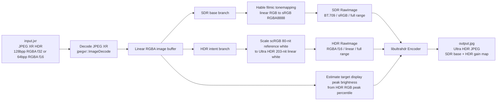

# jxr2uhdr

English | [中文](README.zh-CN.md)

Convert JPEG XR (`.jxr`) HDR images to [Ultra HDR](https://developer.android.com/media/platform/hdr-image-format) JPEG files.

🌐 **Try it online:** [https://tfx2001.github.io/jxr2uhdr/](https://tfx2001.github.io/jxr2uhdr/) — Browser-based converter powered by WebAssembly, no installation required.

Ultra HDR is a backward-compatible JPEG format developed by Google that embeds an HDR gain map alongside a standard SDR base image. The resulting file can be displayed as normal SDR on legacy devices, while HDR-capable displays render the full high dynamic range.

## Use Case

NVIDIA's in-game screenshot capture tool saves HDR frames as JPEG XR (128bpp RGBA float). This tool converts those captures directly to Ultra HDR JPEG, which is natively supported on Android 14+ and modern displays.

Current conversion pipeline:



## Installation

```bash
cargo install --path jxr2uhdr-cli
```

Or build without installing:

```bash
cargo build --release -p jxr2uhdr
# Binary: target/release/jxr2uhdr
```

## Usage

```
jxr2uhdr --input <INPUT> --output <OUTPUT> [--quality <QUALITY>]

Options:
  -i, --input <INPUT>      Input JXR file path
  -o, --output <OUTPUT>    Output Ultra HDR JPG file path
  -q, --quality <QUALITY>  Quality of the output base JPEG (0-100) [default: 90]
  -h, --help               Print help
  -V, --version            Print version
```

**Example:**

```bash
jxr2uhdr -i screenshot.jxr -o output.jpg
jxr2uhdr -i screenshot.jxr -o output.jpg --quality 95
```

Log verbosity can be controlled via the `RUST_LOG` environment variable:

```bash
RUST_LOG=debug jxr2uhdr -i screenshot.jxr -o output.jpg
```

## Build

```bash
# Debug build
cargo build -p jxr2uhdr

# Release build (recommended for production use)
cargo build --release -p jxr2uhdr
```

## Test

```bash
cargo test --workspace
```

## License

MIT
