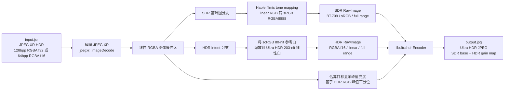

# jxr2uhdr

将 JPEG XR（`.jxr`）HDR 图像转换为 [Ultra HDR](https://developer.android.com/media/platform/hdr-image-format) JPEG 文件。

🌐 **在线体验：** [https://tfx2001.github.io/jxr2uhdr/](https://tfx2001.github.io/jxr2uhdr/) — 基于 WebAssembly 的浏览器端转换器，无需安装任何软件。

Ultra HDR 是 Google 推出的一种向下兼容的 JPEG 格式，在标准 SDR 基础图像之上嵌入 HDR 增益图。生成的文件在不支持 HDR 的设备上仍可作为普通 JPEG 显示，而支持 HDR 的显示器则能还原完整的高动态范围。

## 使用场景

NVIDIA 游戏内截图工具会将 HDR 画面保存为 JPEG XR 格式（128bpp RGBA float）。本工具可将这些截图直接转换为 Ultra HDR JPEG，原生支持 Android 14+ 及现代 HDR 显示器。

当前转换 pipeline：



## 安装

```bash
cargo install --path jxr2uhdr-cli
```

或仅构建，不安装：

```bash
cargo build --release -p jxr2uhdr
# 产物路径：target/release/jxr2uhdr
```

## 用法

```
jxr2uhdr --input <INPUT> --output <OUTPUT> [--quality <QUALITY>]

参数：
  -i, --input <INPUT>      输入 JXR 文件路径
  -o, --output <OUTPUT>    输出 Ultra HDR JPG 文件路径
  -q, --quality <QUALITY>  输出 JPEG 质量（0-100），默认 90
  -h, --help               显示帮助
  -V, --version            显示版本
```

**示例：**

```bash
jxr2uhdr -i screenshot.jxr -o output.jpg
jxr2uhdr -i screenshot.jxr -o output.jpg --quality 95
```

可通过 `RUST_LOG` 环境变量控制日志详细程度：

```bash
RUST_LOG=debug jxr2uhdr -i screenshot.jxr -o output.jpg
```

## 构建

```bash
# 调试构建
cargo build -p jxr2uhdr

# Release 构建（推荐正式使用）
cargo build --release -p jxr2uhdr
```

## 测试

```bash
cargo test --workspace
```

## 许可证

MIT
